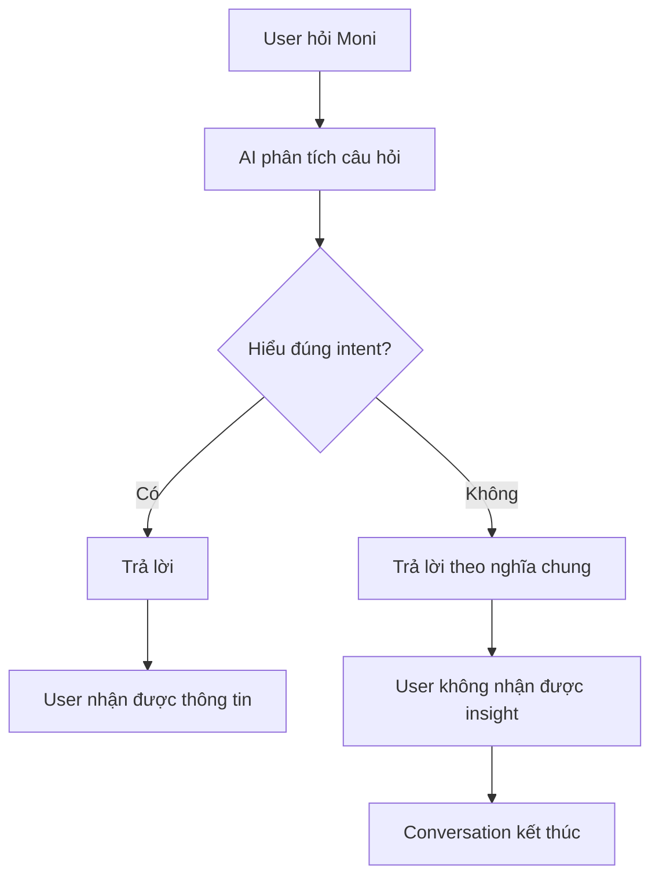
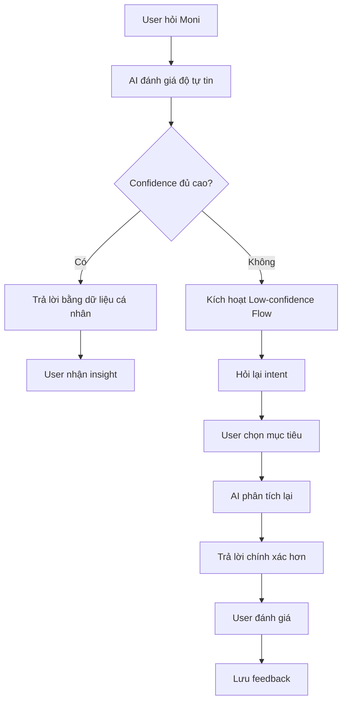

# Workshop — Mổ App AI Thật

**Học viên:** Nguyễn Tuấn Anh
**Mã sinh viên:** 2A202600758
**Sản phẩm được chọn:** MoMo — Moni
**AI Feature:** Trợ thủ tài chính, phân tích chi tiêu, chatbot

---

# 1. Chọn một sản phẩm để dùng thử

| Sản phẩm    | AI feature                                     | Cách truy cập |
| ----------- | ---------------------------------------------- | ------------- |
| MoMo — Moni | Trợ thủ tài chính, phân tích chi tiêu, chatbot | App MoMo      |

**Lý do chọn:**

Moni là AI assistant được tích hợp trực tiếp trong MoMo nhằm hỗ trợ người dùng quản lý tài chính cá nhân. Đây là một use case gần với nhu cầu thực tế của sinh viên và người đi làm nên phù hợp để phân tích workflow AI.

---

# 2. Dùng thử: Promise vs Reality

## Product hứa gì?

Moni được giới thiệu là trợ lý tài chính cá nhân giúp người dùng:

* Theo dõi chi tiêu
* Hiểu tình hình tài chính
* Đưa ra gợi ý quản lý tiền
* Hỗ trợ lập kế hoạch tiết kiệm

## User nào được hứa sẽ được giúp?

* Người dùng MoMo
* Sinh viên
* Người đi làm
* Người muốn quản lý tài chính cá nhân

## Em kỳ vọng AI làm được task nào?

* Cho biết đang tiêu nhiều tiền vào đâu
* Đánh giá tình trạng chi tiêu hiện tại
* Đưa ra insight tài chính cá nhân
* Hỗ trợ lập kế hoạch tiết kiệm
* Giải thích các khoản chi tiêu bất thường

## Khi dùng thật, điểm gãy xuất hiện ở đâu?

Một số câu hỏi được AI hiểu theo nghĩa chung thay vì ngữ cảnh tài chính cá nhân của người dùng.

AI có khả năng nhận biết thiếu dữ liệu nhưng chưa chủ động dẫn dắt người dùng tiếp tục cuộc hội thoại.

---

## Evidence

### Screenshot

Đính kèm 4 screenshot từ quá trình trải nghiệm Moni:

* Screenshot 1: "Tháng này tôi tiêu nhiều nhất vào đâu?" 
* Screenshot 2: "Tôi có đang tiêu quá tay không?"
* Screenshot 3: "Chi tiêu linh tinh là gì?"
* Screenshot 4: "Tôi muốn tiết kiệm 2 triệu trong tháng tới"

---

### Quote từ App

Moni được MoMo giới thiệu là:

> "Trợ lý tài chính AI hỗ trợ người dùng quản lý chi tiêu và đưa ra các gợi ý tài chính cá nhân."

(Nguồn: Giao diện Moni trong ứng dụng MoMo)

---

### Prompt/Input đã thử

```text
Tháng này tôi tiêu nhiều nhất vào đâu?
```

```text
Tôi có đang tiêu quá tay không?
```

```text
Chi tiêu linh tinh là gì?
```

```text
Tôi muốn tiết kiệm 2 triệu trong tháng tới
```

---

### Hành vi quan sát được

| Prompt                                     | Hành vi quan sát được                                                   |
| ------------------------------------------ | ----------------------------------------------------------------------- |
| Tháng này tôi tiêu nhiều nhất vào đâu?     | AI trả về tổng chi tiêu nhưng không cho biết danh mục chi tiêu lớn nhất |
| Tôi có đang tiêu quá tay không?            | AI nhận biết thiếu dữ liệu ngân sách nhưng chưa hỏi thêm thông tin      |
| Chi tiêu linh tinh là gì?                  | AI trả lời theo định nghĩa chung thay vì dữ liệu cá nhân                |
| Tôi muốn tiết kiệm 2 triệu trong tháng tới | AI hỏi thêm thông tin trước khi đưa ra lời khuyên                       |

---

# 3. Vẽ 4 Paths

| Path           | Câu hỏi cần trả lời                                                           |
| -------------- | ----------------------------------------------------------------------------- |
| Happy          | Khi AI đúng và tự tin, user thấy gì?                                          |
| Low-confidence | Khi AI không chắc, hệ thống có hỏi lại, show options hoặc chuyển người không? |
| Failure        | Khi AI sai, user biết bằng cách nào và sửa thế nào?                           |
| Correction     | Khi user sửa, correction có được lưu/log/học lại không hay biến mất?          |

---

## Happy Path

User hỏi:

```text
Tôi muốn tiết kiệm 2 triệu trong tháng tới
```

AI nhận ra chưa đủ dữ liệu để tư vấn.

AI hỏi thêm:

* Thu nhập
* Mức chi tiêu dự kiến

User tiếp tục cung cấp dữ liệu.

AI có thể xây dựng kế hoạch tiết kiệm phù hợp.

**Kết quả:** User nhận được hỗ trợ đúng mục tiêu.

---

## Low-confidence Path

User hỏi:

```text
Tôi có đang tiêu quá tay không?
```

AI nhận ra chưa có dữ liệu ngân sách.

AI từ chối đưa ra kết luận.

Tuy nhiên AI chưa hỏi tiếp:

* Ngân sách tháng của bạn là bao nhiêu?
* Thu nhập hàng tháng là bao nhiêu?

**Kết quả:** Cuộc hội thoại bị dừng giữa chừng.

---

## Failure Path

User hỏi:

```text
Tháng này tôi tiêu nhiều nhất vào đâu?
```

AI trả lời:

* Tổng chi tiêu
* Số giao dịch
* Chi tiêu trung bình

Nhưng không cho biết nhóm chi tiêu lớn nhất.

**Kết quả:** User không nhận được insight mà mình đang tìm kiếm.

---

## Correction Path

Sau mỗi câu trả lời, Moni chỉ cung cấp nút đánh giá:

* Có
* Không

Người dùng có thể đánh giá câu trả lời hữu ích hay không.

Tuy nhiên không có cơ chế:

* Sửa intent
* Yêu cầu AI hiểu lại câu hỏi
* Chỉnh lại câu trả lời

**Kết quả:** Không quan sát được correction loop rõ ràng trong sản phẩm.

---

# 4. Viết Finding thành quyết định

## Finding 1

Khi user hỏi:

```text
Tháng này tôi tiêu nhiều nhất vào đâu?
```

AI chỉ trả về tổng số tiền chi tiêu thay vì xác định danh mục chi tiêu lớn nhất.

Hậu quả là user không nhận được insight cần thiết để điều chỉnh hành vi tài chính.

Lỗi thuộc layer:

**Intent + Data Tool**

Nên sửa bằng:

* AI cần map câu hỏi sang chức năng phân tích danh mục chi tiêu.
* Hiển thị Top nhóm chi tiêu lớn nhất.
* Cho phép drill-down xem từng nhóm giao dịch.

---

## Finding 2

Khi user hỏi:

```text
Chi tiêu linh tinh là gì?
```

AI hiểu đây là câu hỏi định nghĩa.

Trong khi người dùng có thể đang hỏi về các khoản chi tiêu linh tinh của chính mình.

Hậu quả là AI bỏ lỡ ngữ cảnh tài chính cá nhân.

Lỗi thuộc layer:

**Intent + UX Recovery**

Nên sửa bằng low-confidence path:

```text
Bạn muốn:
1. Xem định nghĩa chi tiêu linh tinh
2. Xem các khoản chi tiêu linh tinh của bạn
```

---

## Finding 3

Khi user hỏi:

```text
Tôi có đang tiêu quá tay không?
```

AI nhận ra thiếu dữ liệu nhưng chưa chủ động thu thập thêm thông tin.

Hậu quả là cuộc hội thoại kết thúc mà user vẫn chưa nhận được hỗ trợ.

Lỗi thuộc layer:

**UX Recovery**

Nên sửa bằng:

* Hỏi thêm thu nhập
* Hỏi thêm ngân sách
* Hỏi mục tiêu tiết kiệm

trước khi đánh giá.

---

# 5. Sketch As-Is / To-Be

## As-Is

```text
User hỏi Moni
↓
AI phân tích câu hỏi
↓
Nếu hiểu đúng → Trả lời
↓
Nếu hiểu sai → Trả lời theo nghĩa chung
↓
User không nhận được insight
↓
Conversation kết thúc
```

### Điểm gãy

* Thiếu làm rõ intent
* Thiếu recovery flow
* Thiếu correction loop

---

## To-Be

```text
User hỏi Moni
↓
AI đánh giá độ tự tin

Nếu tự tin cao
↓
Trả lời bằng dữ liệu cá nhân

Nếu tự tin thấp
↓
Hỏi lại intent

↓
User xác nhận

↓
AI phân tích lại

↓
Trả lời chính xác hơn

↓
User đánh giá kết quả

↓
Lưu feedback
```

---

### Workflow As-Is



---

### Workflow To-Be



---

# 6. Tự kiểm trước khi nộp

* [x] Có ít nhất 1 screenshot hoặc observation cụ thể.
* [x] Có quote từ app.
* [x] Có prompt/input đã thử.
* [x] Có hành vi quan sát được.
* [x] Có đủ 4 paths.
* [x] Finding được viết thành product decision, không chỉ là nhận xét.
* [x] Sketch có as-is và to-be.
* [x] Có một câu nói rõ finding này sẽ đổi gì trong SPEC.

---

# 9. Reflection cá nhân

## Vai trò cá nhân

Research, self-use và product thinking cho một AI assistant trong lĩnh vực quản lý tài chính cá nhân.

## Việc em đã làm

* Đọc yêu cầu Day05 và template Workshop "Mổ App AI Thật".
* Chọn sản phẩm AI thực tế để trải nghiệm: MoMo - Moni.
* Sử dụng trực tiếp Moni với nhiều câu hỏi khác nhau liên quan đến quản lý chi tiêu và tiết kiệm.
* Chụp screenshot và ghi lại các hành vi quan sát được từ sản phẩm.
* Phân tích sự khác biệt giữa Product Promise và Reality khi sử dụng thực tế.
* Xây dựng 4 paths gồm Happy Path, Low-confidence Path, Failure Path và Correction Path.
* Chuyển các observation thành finding và đề xuất product requirement để cải thiện trải nghiệm người dùng.

## AI hỗ trợ phần nào

AI được sử dụng để:

* Hỗ trợ đọc và hiểu yêu cầu workshop.
* Gợi ý cấu trúc báo cáo.
* Hỗ trợ tổng hợp observation thành finding.
* Hỗ trợ mô tả workflow và viết markdown.

Các finding, evidence và kết luận trong bài đều dựa trên trải nghiệm thực tế với Moni và các screenshot thu thập được trong quá trình sử dụng sản phẩm.

## Bài học rút ra

Qua bài workshop, em nhận ra rằng một AI product không chỉ được đánh giá bởi khả năng trả lời đúng hay sai.

Điều quan trọng hơn là:

* AI có nhận ra khi nào mình không chắc chắn hay không.
* AI có chủ động hỏi thêm thông tin để hiểu đúng nhu cầu người dùng hay không.
* AI có cơ chế xử lý khi hiểu sai intent hay không.
* AI có cho phép người dùng sửa hoặc phản hồi lại câu trả lời hay không.

Trong trường hợp của Moni, điểm gãy lớn nhất không phải là AI trả lời sai hoàn toàn mà là việc AI đôi khi hiểu câu hỏi theo nghĩa chung thay vì ngữ cảnh tài chính cá nhân của người dùng. Điều này khiến người dùng không nhận được insight mà họ thực sự mong muốn.

Bài học quan trọng nhất em rút ra là:

> Một AI tốt không phải lúc nào cũng biết câu trả lời, mà phải biết khi nào cần hỏi lại để hiểu đúng người dùng trước khi trả lời.
