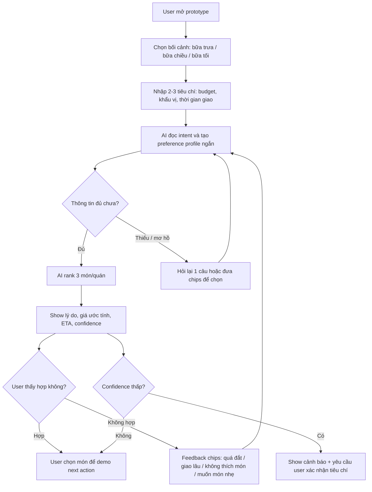

# Synthesis / Decide Toolkit - Food & Delivery

## 1. Gom evidence thành cụm

| Cụm workflow/pain | Evidence liên quan | Nhóm học được |
|---|---|---|
| Không biết ăn gì | Grab nói 74% user browse khi chưa có cuisine cụ thể. | User cần AI giúp biến nhu cầu mơ hồ thành vài lựa chọn cụ thể. |
| Mất thời gian browsing | Grab nói user trung bình browse 17 phút trước khi order. | Prototype nên giảm thời gian chọn xuống còn 1-2 phút. |
| Quá nhiều lựa chọn | ShopeeFood public site hiển thị số lượng địa điểm rất lớn ở TP.HCM/Hà Nội. | User cần lọc theo mục tiêu thật: ngân sách, giao nhanh, khẩu vị, no/nhẹ. |
| Gợi ý sai hoặc chung chung | Recommendation chỉ hữu ích nếu có context cá nhân và feedback. | Prototype cần low-confidence path và correction chips. |

## 2. Insight

```text
User sinh viên/nhân viên văn phòng không chỉ cần danh sách quán ăn.
Họ thật ra cần hỗ trợ ra quyết định nhanh trong lúc đang đói, bận, và chưa có keyword rõ,
vì evidence cho thấy nhiều user browse lâu và phần lớn không có cuisine cụ thể khi mở app.
```

## 3. Opportunity

```text
Cơ hội là dùng AI để augment bước chọn món rất hẹp:
hỏi user 2-3 câu về budget, mood/khẩu vị, thời gian giao,
giúp user nhận 3 gợi ý món/quán có lý do rõ,
trong khi vẫn kiểm soát failure bằng confidence, nút sửa tiêu chí và fallback "xem thêm lựa chọn".
```

## 4. Build slice

**Build slice được chọn:**

```text
Cho sinh viên/nhân viên văn phòng đang đói nhưng chưa biết ăn gì,
prototype dùng AI để hỏi nhanh nhu cầu và rank 3 món/quán phù hợp,
tạo ra danh sách gợi ý có lý do, giá ước tính, thời gian giao ước tính và mức confidence,
và xử lý failure "gợi ý không hợp khẩu vị/ngân sách" bằng feedback chips để sửa ngay.
```

**Checklist build slice:**

| Câu hỏi | Đạt chưa? | Ghi chú |
|---|---|---|
| User cụ thể chưa? | Đạt | Sinh viên/nhân viên văn phòng ở đô thị, đang đặt bữa trưa/bữa chiều. |
| Task đủ hẹp chưa? | Đạt | Chỉ gợi ý 3 món/quán, không build toàn bộ app đặt hàng. |
| AI decision rõ chưa? | Đạt | AI phân loại nhu cầu và rank lựa chọn. |
| Failure path rõ chưa? | Đạt | Gợi ý sai khẩu vị, quá đắt, giao lâu, thiếu dietary constraint. |
| Có evidence không? | Đạt | Grab official article + ShopeeFood public scale + self-use plan. |

## 5. Quyết định: giữ, giảm scope, hay đổi hướng?

**Quyết định:** Giữ domain Food & Delivery, giảm scope xuống một flow chọn món.

| Phần không build | Lý do |
|---|---|
| Thanh toán, đặt hàng thật, tracking shipper | Quá rộng và cần API thật. |
| Cá nhân hóa dài hạn bằng lịch sử thật | Không có dữ liệu user thật trong 1 ngày. |
| Tối ưu voucher/phí giao chính xác | Cần data real-time từ app. |
| Chatbot tổng quát cho mọi việc ăn uống | Quá rộng, dễ thành "AI assistant" chung chung. |

## 6. Workflow prototype rõ ràng



## 7. Four paths cần demo

| Path | Input demo | Output kỳ vọng |
|---|---|---|
| Happy | "Ăn trưa dưới 70k, no, không cay, giao dưới 25 phút" | 3 gợi ý món/quán hợp tiêu chí, có lý do. |
| Low-confidence | "Ăn gì cũng được" | AI hỏi lại budget/mood hoặc show chips, không tự tin bịa. |
| Failure | User nói "không ăn bò" nhưng AI gợi ý phở bò/bún bò. | Prototype đánh dấu lỗi, xin lỗi, loại món bò và rerank. |
| Correction | User bấm "quá đắt" hoặc "giao lâu" | AI cập nhật tiêu chí và trả danh sách mới. |

## 8. Câu chốt cuối

```text
Dựa trên evidence GrabFood users browse lâu và nhiều người chưa có cuisine cụ thể,
nhóm sẽ build prototype AI Food Picker,
cho sinh viên/nhân viên văn phòng đang đói nhưng chưa biết ăn gì,
để giải quyết pain mất thời gian chọn món trong quá nhiều lựa chọn,
bằng cách AI hỏi 2-3 câu và gợi ý 3 món/quán phù hợp,
và sẽ test failure path AI gợi ý món vi phạm khẩu vị/ngân sách/dietary constraint.
```

## 9. Backlog

- Tích hợp dữ liệu quán thật từ GrabFood/ShopeeFood.
- Tối ưu voucher/phí giao real-time.
- Lưu lịch sử khẩu vị nhiều ngày.
- Đặt hàng/thanh toán/tracking thật.
- Recommendation theo nhóm nhiều người ăn chung.
