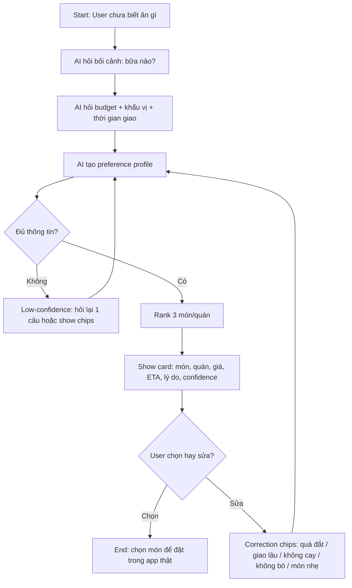

# Thin SPEC Cuối Day 05 - AI Food Picker

Thin SPEC này là bản chốt đủ rõ để sáng Day 06 nhóm build prototype ngay.

## 1. Track, product/app và user

**Track:** Food & Delivery  
**Product/app thật:** GrabFood  
**Tên prototype:** AI Food Picker  
**User cụ thể:** Sinh viên/nhân viên văn phòng ở TP.HCM hoặc Hà Nội, đang đói/bận, muốn đặt đồ ăn nhanh nhưng chưa biết ăn món gì.  
**Nhóm có phải user thật không? Nếu không, khác ở đâu?** Có. Các thành viên nhóm đều là người có thể dùng app giao đồ ăn trong bối cảnh học/làm, cần chọn món nhanh theo ngân sách và thời gian.

## 2. Evidence summary

| Evidence | Nguồn | User/pain nói lên điều gì? | SPEC phải đổi gì? |
|---|---|---|---|
| Grab nói user trung bình browse 17 phút trước khi đặt món. | https://www.grab.com/inside-grab/stories/personalising-food-recommendations-on-grabfood/ | User mất thời gian ở bước chọn món, không phải chỉ ở bước checkout. | Build slice tập trung vào giảm thời gian discovery. |
| Grab nói 74% user browse khi chưa có cuisine cụ thể. | Grab official article | User thường mở app với intent mơ hồ, nên search keyword không đủ. | AI phải hỏi lại/chuyển nhu cầu mơ hồ thành tiêu chí rõ. |
| Grab dùng machine learning-driven search and recommendations để cá nhân hóa food discovery. | Grab official article | AI/recommendation là feature thật trong domain này. | Prototype dùng augmentation: AI rank 3 lựa chọn, user quyết định. |
| ShopeeFood public site hiển thị số lượng địa điểm lớn ở TP.HCM/Hà Nội. | https://shopee.shopeefood.vn/ | Quá nhiều lựa chọn làm user bị overload. | Output phải ngắn: chỉ 3 gợi ý, có lý do và tiêu chí. |

## 3. Pain statement

```text
User sinh viên/nhân viên văn phòng đang gặp khó ở bước chọn món trước khi đặt đồ ăn,
vì app có quá nhiều quán/món/voucher trong khi user thường chưa có cuisine cụ thể,
dẫn tới mất thời gian browsing, chọn đại, hoặc bỏ cuộc.
Bằng chứng chính là Grab nói user browse trung bình 17 phút trước khi order và 74% browse khi chưa có cuisine cụ thể.
```

## 4. Build slice

```text
Cho sinh viên/nhân viên văn phòng đang đói nhưng chưa biết ăn gì,
prototype sẽ dùng AI để hỏi 2-3 câu về ngân sách, khẩu vị/mood và thời gian giao,
tạo ra 3 gợi ý món/quán có lý do, giá ước tính, ETA ước tính và confidence,
và xử lý failure mode "AI gợi ý món không hợp khẩu vị/ngân sách" bằng feedback chips để user sửa và rerank.
```

## 5. Auto/Aug decision

- [x] **Augmentation:** AI gợi ý/draft/phân loại, user quyết cuối.
- [ ] **Conditional automation:** AI tự làm trong case hẹp; case mơ hồ/rủi ro chuyển người.
- [ ] **Automation:** AI tự quyết và tự hành động.

**Lý do chọn:** Chọn món ăn phụ thuộc khẩu vị, dị ứng, ngân sách và tâm trạng. Nếu AI tự quyết có thể làm user mất tiền hoặc nhận món không phù hợp. AI nên hỗ trợ ra quyết định, không đặt hàng thay user.  
**Human role:** decider + trainer. User chọn món cuối cùng và sửa recommendation bằng feedback chips.

## 6. Workflow prototype



## 7. Four paths

| Path | Prototype phải thể hiện gì? |
|---|---|
| Happy | User nhập tiêu chí rõ: "ăn trưa dưới 70k, no, không cay, giao dưới 25 phút". AI trả 3 gợi ý phù hợp, mỗi gợi ý có lý do ngắn và confidence cao. |
| Low-confidence | User nhập quá mơ hồ: "ăn gì cũng được". AI không bịa danh sách ngay; hỏi lại ngân sách/mood hoặc đưa chips "ăn no", "ăn nhẹ", "healthy", "rẻ", "giao nhanh". |
| Failure | User nói "không ăn bò" nhưng AI gợi ý món có bò, hoặc user nói dưới 60k nhưng gợi ý món 90k. Prototype phải hiển thị feedback "không hợp" và rerank. |
| Correction | User bấm chip "quá đắt", "giao lâu", "không cay", "không ăn bò". AI cập nhật preference profile và trả lại danh sách mới. |

## 8. Failure mode nguy hiểm nhất

```text
Nếu user có ràng buộc ăn uống rõ như không ăn bò, không cay, dị ứng hải sản hoặc budget thấp,
AI có thể gợi ý món vi phạm ràng buộc đó,
hậu quả là user mất niềm tin, đặt sai món, mất tiền hoặc gặp rủi ro sức khỏe nhẹ/nặng tùy constraint.
Prototype sẽ xử lý bằng ask again + hiển thị constraint đã hiểu + feedback chips + rerank ngay.
Owner kiểm thử path này là Phúc.
```

## 9. Owner plan cho sáng Day 06

| Thành viên | Việc phụ trách | Bằng chứng cần có trong repo |
|---|---|---|
| Cung | Research / evidence + repo owner | `02-group-spec/evidence-pack.md`, link nguồn Grab/ShopeeFood, screenshot self-use nếu có, commit/push repo. |
| Tuấn Anh | SPEC + prompt logic | `02-group-spec/thin-spec.md`, prompt system/user cho AI Food Picker, tiêu chí input/output. |
| Vũ Anh | Prototype UI | Màn hình nhập nhu cầu, chips tiêu chí, 3 recommendation cards, state low-confidence/correction. |
| Phúc | Test / failure path + demo script | Test cases happy/low-confidence/failure/correction, file demo script, evidence ảnh/video demo. |

## 10. Kế hoạch làm việc Day 06

| Thời điểm | Việc cần làm | Owner chính | Output |
|---|---|---|---|
| 08:30-09:00 | Chốt data mẫu: 8-12 món/quán giả lập với giá, ETA, tag khẩu vị | Cung + Tuấn Anh | Mock data trong prototype |
| 09:00-10:30 | Build UI input + recommendation cards | Vũ Anh | Prototype chạy được path happy |
| 10:30-11:00 | Viết prompt/ranking logic và confidence rule | Tuấn Anh | AI trả JSON/list ổn định |
| 11:00-11:30 | Build low-confidence + correction chips | Vũ Anh + Phúc | Path mơ hồ và sửa gợi ý chạy được |
| 11:30-12:00 | Test failure: không bò, không cay, budget thấp, giao nhanh | Phúc | Test log + bug list |
| 13:30-14:30 | Sửa lỗi, thêm evidence screenshot/demo | Cả nhóm | Repo có ảnh/video demo |
| 14:30-15:00 | Viết demo script 3 phút | Phúc + Cung | Demo script trong repo |
| 15:00-16:00 | Rehearse demo và hoàn thiện README | Cả nhóm | Bản nộp cuối |

## 11. Demo script ngắn

```text
1. Mở prototype AI Food Picker.
2. Nhập case happy: "Ăn trưa dưới 70k, no, không cay, giao dưới 25 phút".
3. Cho thấy AI trả 3 gợi ý có lý do, giá, ETA, confidence.
4. Nhập case low-confidence: "Ăn gì cũng được".
5. Cho thấy AI hỏi lại hoặc show chips, không bịa ngay.
6. Nhập failure: "không ăn bò", sau đó nếu có món bò thì bấm "không hợp".
7. Cho thấy prototype loại món bò và rerank.
8. Kết luận: AI không đặt hàng thay user, chỉ giúp user chọn nhanh và sửa được khi sai.
```
